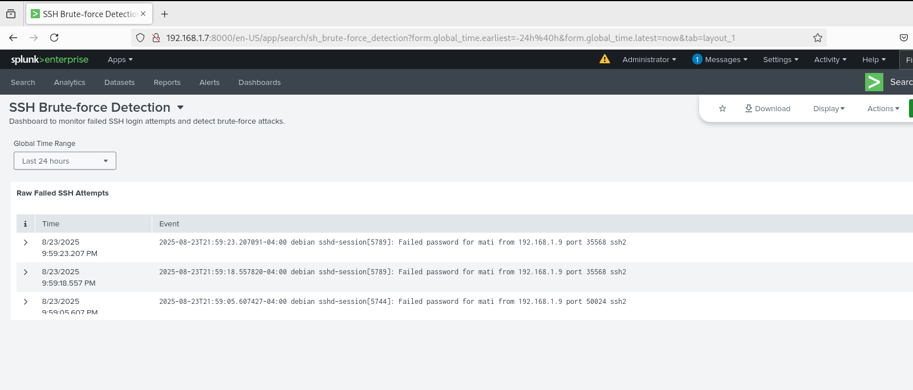

# 🚀 SSH Brute-force Detection with Splunk

## 📌 Overview
This project demonstrates how to detect SSH brute-force attempts using **Splunk Enterprise**.  
It ingests Linux authentication logs (`/var/log/auth.log`) and provides dashboards + alerts for failed login activity.

---

## 📊 Dashboard
The dashboard includes:
- **Raw Failed SSH Attempts**  
- **Top Attacking IPs**  
- **Top Targeted Users**  
- **Failed Logins Over Time (timeline)**  

---

## 📸 Screenshot

---

## ⚡ Alerting
An alert was configured to trigger when **≥5 failed attempts** occur within 1 minute.  
This simulates brute-force attack detection and early warning capabilities.

---

## 🔑 Use Cases
- SOC / SIEM practice labs  
- Security monitoring in Linux environments  
- Learning Splunk Search Processing Language (SPL)  

---

## 🛠️ Tech Stack
- Debian 13  
- Splunk Enterprise 10.0  
- SSH + auth.log parsing  
